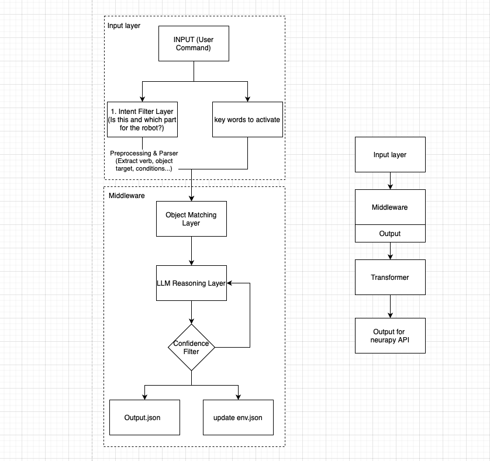

# Robotic Arm Middleware

A modular NLP-to-motion pipeline that interprets natural language commands and translates them into robotic arm control actions, with environmental awareness and reasoning via a local LLM.

---

## 🧠 Project Overview

This middleware connects natural language input to a robotic control system. It performs:

1. **Intent Detection** – Determines whether input requires robotic action.
2. **Object Matching** – Parses environment data and finds relevant objects.
3. **LLM Reasoning** – Uses a local LLM to generate a chain-of-thought plan.
4. **Feedback Loop** – Handles uncertainty via clarification or rejections.
5. **Output Generation** – Produces structured action steps (`Output.json`).

---

## 🏗️ Middleware architecture 


---

## 📁 Project Structure

```
robotic-arm-middleware/
│
├── app.py                       # Entry point of the middleware
│
├── input\_layer/
│   └── intent\_filter.py         # Filters whether command targets robotic arm
│
├── middleware/
│   └── pipeline.py              # Core logic: match, reasoning, output
│
├── utils/
│   └── env\_loader.py            # Environment.json loader
│
├── data/
│   ├── environment.json         # Current scene objects (input)
│   └── output.json              # Generated step-by-step plan (output)
│
├── llm/
│   └── dummy\_llm.py             # Placeholder LLM call logic (replaceable)
│
└── README.md                    # You're reading it
```
---

## 🔧 Requirements

- Python 3.8+
- `openai` or your own LLM client SDK
- Your local model endpoint (e.g. LM Studio, Ollama)

Install dependencies:

```
pip install openai
```

---

## 🚀 How to Run

1. Place your `environment.json` in `data/`.

2. Run the app application:

```
python app.py
```

3. Enter a command:

```
move the handy next to the fruit
```

4. Generated plan will appear in `data/output.json`.

---

## 🔄 Replace Dummy LLM

Update `llm/dummy_llm.py` to point to your local/remote LLM API:

```
client = OpenAI(base_url="http://localhost:1234/v1", api_key="your-key")
# for LM Studio
# client = OpenAI(base_url="http://localhost:1234/v1", api_key="lm-studio")
response = client.chat.completions.create(...)
```

---

## 📌 TODO

* [ ] Add speech-to-text preprocessing layer
* [ ] Collision detection refinement
* [ ] Neurapy arm API integration

---

## 📜 License

MIT License © 2025